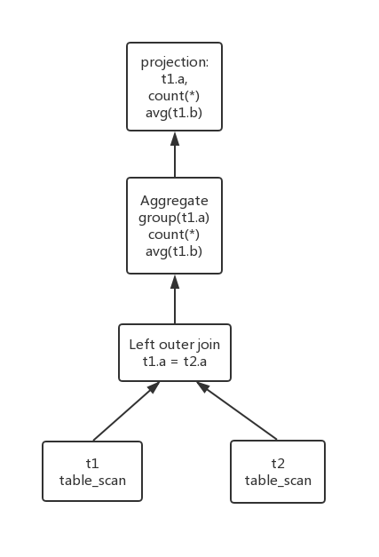
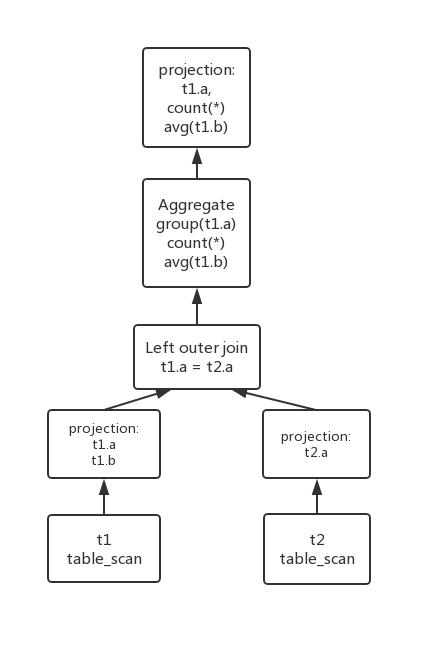

## 查询计算计划

待查询语句
```sql
select 
	t1.a, count(*), avg(t1.b)
	from t1 
	left outer join t2 on t1.a = t2.a 
	group by t1.a
```

分析：

- 联接方式为 t1 左外联接 t2
- 查询内容为按 a 分组后 a，行数，和 b 的平均值

用于执行一个查询的原语操作序列称为**查询执行计划**
我们不能寄希望于用于写出具有最高效率执行计划的查询语句，相反构造具有最小查询执行代价的查询执行计划应该是系统的责任，称为**查询优化**

如果一个 sql 语句能够被翻译为多个关系代数，（许多数据库采用基于给定 SQL 查询结构的带注释的语法分析树来表示），那它就有多个执行计划。

#### 聚集

对于聚集函数而言，可以在组的构造过程中就实现聚集运算。

### 执行计划

首先不管哪种执行计划，对于连接的实现都可以使用循环联接、归并接连以及散列连接三种。以及表达式计算的过程中，如果存在多个运算，有两种实现方式。
显而易见的是，我们可以以适当的顺序每次执行一种操作，每次计算的结果被物化到一个临时关系中以备后用。缺点是每次都需要构造临时关系，这些临时关系都需要写入磁盘，另一种方法是在流水线中同时计算多个运算，一个运算的结果传递给下一个而不必保存临时关系。
读写磁盘使得这两种方式的代价可能会相差很大，但有的情况下只能使用物化方式。

#### 执行计划1

先将 t1 与 t2 进行左外连接再执行聚合运算



先执行左外连接，左外连接的实现策略有两种，第一种是先计算相应的连接，然后将适当的元组加入连接结果中得到外连接结果。首先我们计算 t1 和 t2 的等值连接并将结果物化到一个临时关系 q1 中，再将属于 t1 但不属于 t2 的元组以空值填充属于 t2 的属性加入到 q1 中得到外连接的结果。第二种是通过扩展连接算法实现。 

**分析**

t1 和 t2 中的数据如果含有很多属性，那么直接执行左外连接可能会产生一个非常大的临时关系，并且这个临时关系还需要物化到磁盘中，那么执行性能会有很大的下降，考虑到结果只与 t1 中的 a 和 b 属性有关，t2 中只与 a 属性有关，可以考虑在数据输入的过程中，先对表数据进行投影，只获取需要的数据进行连接。


#### 执行计划2

相比执行计划1从数据源的部分先把不需要的数据进行 prune



从左外连接到聚集函数的运算可以采用流水线实现，这样对于连接的结果不需要物化到磁盘上，对于 `avg(t1.b)` 可能通过计算 `sum(t1.b)/count(*)` 来实现。这样就不需要在组构成以后再实现聚集运算，可以在组的构成中实现聚集运算。